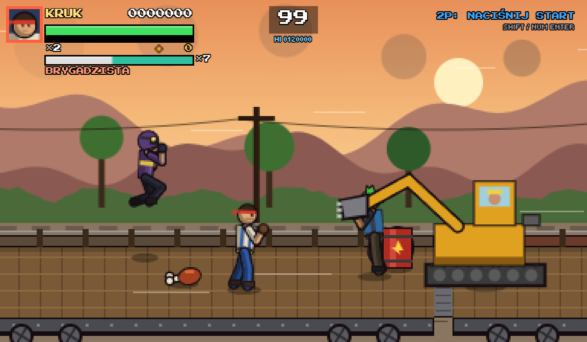
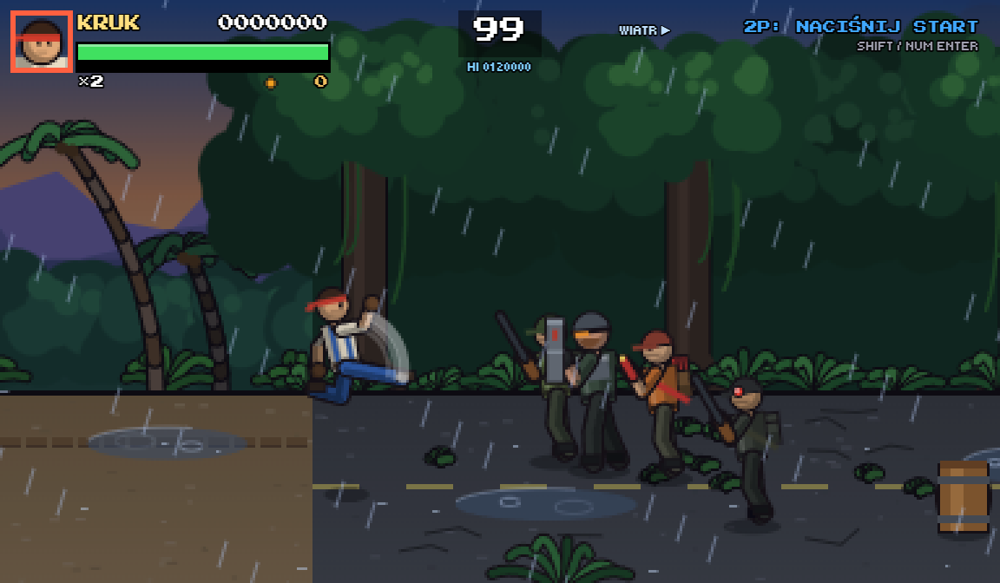
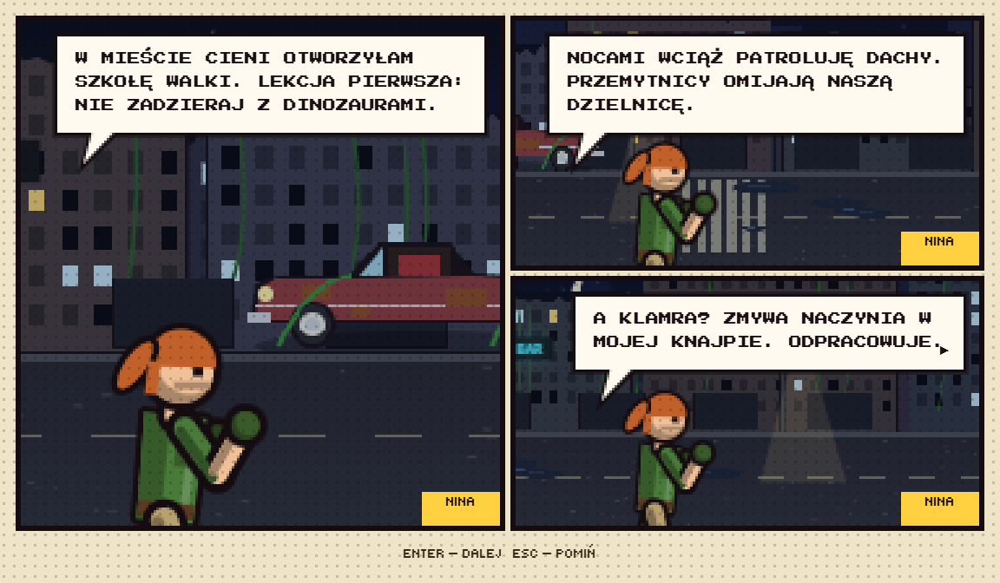
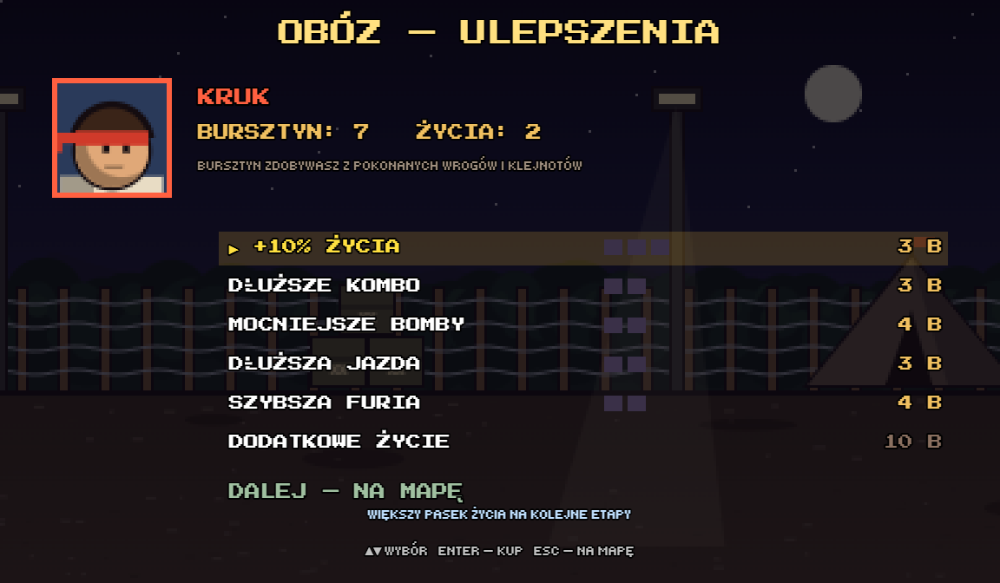
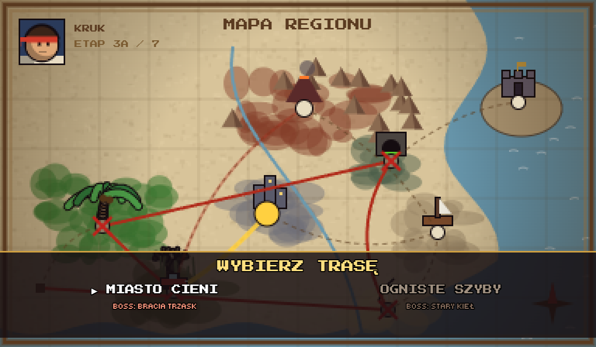
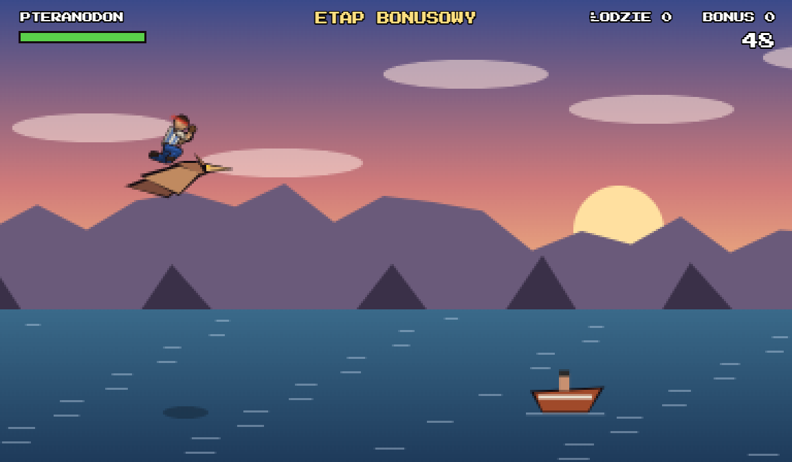
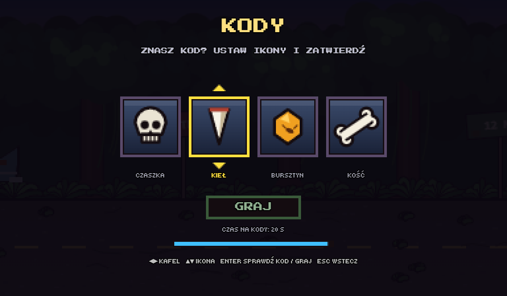
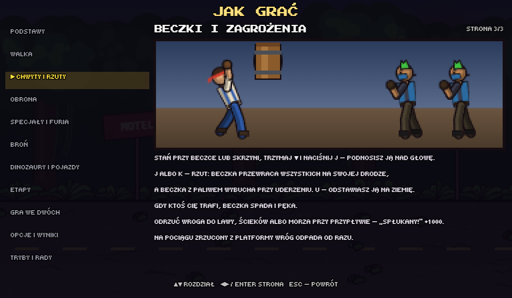
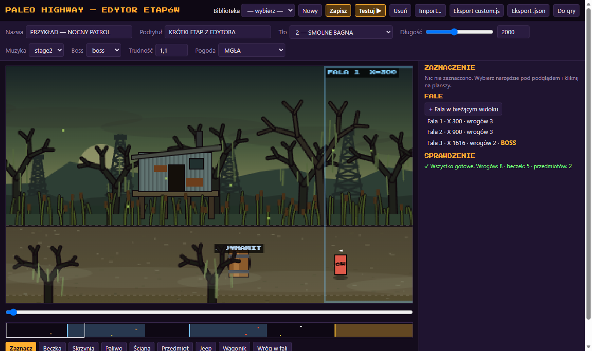

# PALEO HIGHWAY — Rdza i Kły

Bijatyka side-scroll w stylu automatów z lat 90.: czwórka bohaterów odbija dinozaury z rąk kłusowników
na zarośniętej dżunglą autostradzie. Gra działa w przeglądarce, nie ma żadnych zależności, a cała grafika,
muzyka i dźwięki są generowane kodem (Canvas 2D + Web Audio).


| | |
|---|---|
|  |  |
|  |  |
|  |  |
|  |  |
|  |  |
|  |  |

## Co jest w grze

- **8 etapów** z wyborem trasy (miasto albo kopalnia), mapą regionu, obozem z ulepszeniami, epilogiem z ucieczką
  i dwoma zakończeniami; każdy etap ma własnego bossa, muzykę, scenkę komiksową, wydarzenia (przypływ, fala ścieków,
  wagoniki, ulewa) oraz losową pogodę i porę dnia, która wpływa na rozgrywkę.
- **3 etapy bonusowe:** jazda krążownikiem szos, uwalnianie dinozaurów z zagród i lot na pteranodonie,
  plus **etap na pędzącym pociągu** z mini-bossem Brygadzistą w koparce.
- **Zakończenie dla każdej postaci:** krótki komiks o tym, co bohater robi po wszystkim.
- **Sekrety:** pękające ściany ze skarbami i Białym Kłem, prawdziwe zakończenie z Bursztynowym Kolosem.
- **Gra we dwóch** (klawiatura i pady), z atakami drużynowymi: wyrzut partnera, podwójny rzut, wspólny super-ruch.
- **4 bohaterów + 3 do odblokowania**, każdy z własną serią ciosów, specjałem, ruchem komendowym, super-ruchem i okrzykami.
- **Walka:** kombo, chwyty i rzuty, blok i parowanie, żonglerka w powietrzu, odbicia od ścian, broń biała i rzucana,
  dosiadanie dinozaurów i pojazdy, podnoszenie i rzucanie beczek, wrzucanie wrogów do lawy, ścieków i morza.
- **Przeciwnicy z charakterem:** m.in. jeździec na raptorze (zrzuć go i przejmij dinozaura), podpalacz z miotaczem ognia
  i lotniarz zrzucający sieci.
- **Poradnik „JAK GRAĆ”** w menu głównym: 11 rozdziałów i 36 stron z animowanymi pokazami ruchów,
  klawisze i ikony pada dopasowane do Twoich ustawień.
- **Oprawa:** postacie z dwutonowym cieniowaniem i wyraźnym obrysem, oddech w miejscu, zamach przed ciosem i mina bólu,
  wrogowie z rozpoznawalnymi dodatkami (maski, gogle, plecaki, zbiorniki), białe klatki uderzenia, iskry i smugi kopnięć,
  łuny wybuchów i lamp, kałuże odbijające postacie w deszczu, portret w HUD reagujący na walkę
  oraz tryb demo na ekranie tytułowym, jak na prawdziwym automacie.
- **Dźwięk:** utwory ze wstępem oraz częściami A i B, płynne wejście muzyki bossa, dźwięki otoczenia (fale, krople,
  wiatr, deszcz, pociąg), osobne odgłosy pięści, rury, łańcucha, ostrza i tarczy, siedem głosów wrogów.
- **Kody z ikon:** po wybraniu postaci 4 kafle z ikonami; tajne kombinacje włączają wybór etapu i 10 smaczków
  (wielkie głowy, niska grawitacja, kino nieme, hel…). Kombinacje są tajne.
- **Tryby:** zwykła gra, Nowa Gra+, trening, Boss Rush, przetrwanie, wyzwania z gwiazdkami i codzienne wyzwanie.
- **Ekstra:** 32 osiągnięcia, bestiariusz, odtwarzacz muzyki, karta z wynikiem do udostępnienia, edytor etapów.
- **Wygoda:** zapis postępu, przypisywanie klawiszy i przycisków pada (z wibracjami), sterowanie dotykowe,
  trzy filtry CRT, ramka automatu, tryb opiekuna, praca offline jako aplikacja (PWA).

Pełny opis rozgrywki, sterowania, etapów i trybów: **[docs/INSTRUKCJA.md](docs/INSTRUKCJA.md)**.

## Uruchomienie

Nie trzeba niczego instalować ani budować.

- **Z dysku:** otwórz `index.html` w przeglądarce (Chrome, Edge, Firefox). Pierwszy klawisz włącza dźwięk.
- **Jako aplikacja (offline, instalacja):** uruchom lokalny serwer i otwórz `http://localhost:8080`:
  ```
  node tools/serve.mjs
  ```
  W Windows wystarczy dwuklik na `uruchom-serwer.bat`. Na telefonie grę trzeba udostępnić przez https
  (dowolny hosting plików statycznych), a potem „Dodaj do ekranu głównego”.

Pady są wykrywane po naciśnięciu dowolnego przycisku przy aktywnym oknie gry.

## Sterowanie (domyślne)

| Akcja | Gracz 1 | Gracz 2 | Pad |
|---|---|---|---|
| Ruch | WASD | strzałki | gałka / krzyżak |
| Atak | J / Z | , / Num 1 | A / X |
| Skok | K / X / Spacja | . / Num 2 | B / Y |
| Specjał | atak + skok naraz | atak + skok naraz | A + B |
| Blok (trzymaj) | U / V | ' / Num 0 | LB / LT |
| Start / dołączenie | Enter | prawy Shift / Num Enter | Start |
| Pauza | P lub Esc | | Select |
| Wstecz w menu | Esc | Esc | B |
| Wyciszenie | M | | |

Wszystkie przypisania zmienisz w **OPCJE**.

## Konfiguracja

Domyślne ustawienia są w [`config.js`](config.js); zmiany z menu OPCJE zapisują się w przeglądarce i mają pierwszeństwo.

| Klucz | Znaczenie |
|---|---|
| `debug` | `true` — po wyborze postaci ekran wyboru etapu (także bonusów; to samo daje kod z ikon) i uchwyty testowe |
| `difficulty` | `'easy'`, `'normal'`, `'arcade'` |
| `lives` | liczba żyć na start (1–5) |
| `musicVolume`, `sfxVolume` | głośność 0–10 |
| `assist` | tryb opiekuna: część ciosów blokowana automatycznie, podpowiedzi o wrogach |
| `touch` | sterowanie dotykowe: `'auto'`, `'on'`, `'off'` |
| `crt` | filtr: `'off'`, `'arcade'`, `'pc'`, `'tv'` |
| `rumble` | wibracje pada |
| `bezel` | ramka automatu po bokach ekranu |

Parametry adresu: `index.html?stage=5` startuje od wybranego etapu (1–8), `index.html?test=1` uruchamia etap
przesłany z edytora.

## Edytor etapów

[`editor.html`](editor.html) to edytor w przeglądarce: tło jednego z etapów gry, fale wrogów, beczki, sekrety,
przedmioty, pojazdy i pogoda. Etapy zapisują się w przeglądarce (od razu są w grze w **EKSTRA → WŁASNE ETAPY**)
i eksportują do [`js/stages/custom.js`](js/stages/custom.js), który zawiera przykładowy etap.

## Struktura projektu

```
index.html              gra
editor.html             edytor etapów
export.html             odsłuch i eksport muzyki oraz efektów do WAV
config.js               ustawienia domyślne
src/game/               źródła silnika gry w 30 częściach (wejście, gracz, AI, nowi wrogowie, tryby, HUD, kody, poradnik, pętla…)
js/game.js              silnik zbudowany z src/game/ (plik generowany — nie edytuj ręcznie)
js/audio.js             syntezator dźwięków, instrumenty, sekwencer, utwory, okrzyki postaci
js/sprites.js           szkieletowe postacie, dinozaury, pojazdy, bronie, przedmioty
js/scenery.js           elementy scenerii i fabryka etapów (warstwy paralaksy)
js/bonus.js, flight.js  etapy bonusowe: jazda autem i lot na pteranodonie
js/editor.js            logika edytora etapów
js/stages/              etapy (stage1–8), pociąg (train.js), areny specjalne, rozszerzenia i własne etapy
assets/audio/           wyeksportowana muzyka i efekty (WAV)
icons/, manifest.webmanifest, sw.js   aplikacja PWA i praca offline
tools/                  budowanie, testy automatyczne, serwer lokalny, eksport audio, generator ikon
docs/                   instrukcja gry i zrzuty ekranu (docs/screenshots/)
```

## Narzędzia

Wymagają Node.js 22+; eksport audio dodatkowo przeglądarki Edge lub Chrome.

| Polecenie | Działanie |
|---|---|
| `node tools/build.mjs` | składa `js/game.js` ze źródeł w `src/game/` (`--check` — tylko sprawdza, czy jest aktualny) |
| `node tools/tests/run.mjs [nazwa…]` | testy automatyczne w przeglądarce bez okna (wszystkie albo wybrane); zrzuty w `tools/tests/out/` |
| `node tools/serve.mjs [port]` | lokalny serwer (domyślnie port 8080) |
| `node tools/export-audio.mjs` | renderuje wszystkie utwory i efekty do `assets/audio/` |
| `node tools/screenshots.mjs` | robi aktualne zrzuty ekranu do `docs/screenshots/` (README i instrukcja) |
| `tools/icon.html` | generator ikon aplikacji |

Po zmianie listy plików gry podbij wersję `CACHE` w [`sw.js`](sw.js), żeby zainstalowana aplikacja pobrała nowe pliki.

### Praca z kodem

1. Zmieniaj pliki w `src/game/` (silnik) albo `js/` (pozostałe moduły), nie `js/game.js`.
2. Zbuduj silnik: `node tools/build.mjs`.
3. Uruchom testy: `node tools/tests/run.mjs` — 17 scenariuszy sprawdza m.in. wszystkie etapy i bossów, walkę,
   pady, tryby, wydarzenia i pogodę, komiks, lot, zakończenia, edytor, poradnik, beczki i nowych wrogów, pociąg,
   grafikę i tryb demo, muzykę i dźwięki oraz kody z ikon; test kończy się błędem także przy każdym wyjątku
   JavaScript w grze. Testy same budują silnik przed startem.
4. Po zmianach w wyglądzie odśwież zrzuty: `node tools/screenshots.mjs`.

Uchwyty testowe (`window.__paleo`) są dostępne tylko z `debug: true` w `config.js` albo z parametrem adresu `?hooks=1`.

## Zasoby i prawa

Gra jest inspirowana gatunkiem bijatyk z automatów, ale wszystkie postacie, nazwy, grafika, muzyka i dźwięki są
oryginalne i powstają w kodzie. Projekt nie zawiera cudzych zasobów. Jedyny zewnętrzny element to czcionki
*Press Start 2P* i *Tiny5* wczytywane z Google Fonts (licencja SIL Open Font License).

## Licencja

Projekt jest udostępniony na licencji **MIT** — patrz plik [`LICENSE`](LICENSE). Możesz grę i jej kod swobodnie
używać, kopiować, zmieniać i rozpowszechniać (także komercyjnie), pod warunkiem zachowania informacji o prawach
autorskich i treści licencji. Czcionki *Press Start 2P* i *Tiny5* mają własną licencję SIL Open Font License.
